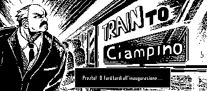
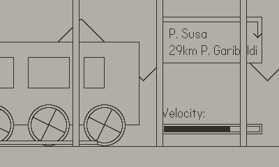

# Train to Ciampino

A minister is requesting a special stop to Roma Ciampino. Turn the crank to accelerate the train, but not too much or it will explode!

Game card made by the one and only [Joemi](https://github.com/nannamordor) <3

Made in 48h for the [Roma Game Dev 2024](https://globalgamejam.org/jam-sites/2024/roma-game-dev-jam-chapter-14) Global Game Jam

Any reference to events, places and persons is purely coincidental

## Installation

First you need to [follow the instructions](https://github.com/boozook/playdate?tab=readme-ov-file#prerequisites) to install the [Playdate API and build tools in Rust](https://github.com/boozook/playdate) and then run

    cargo +nightly playdate run

Or if you have a device connected

    cargo +nightly playdate run --device
